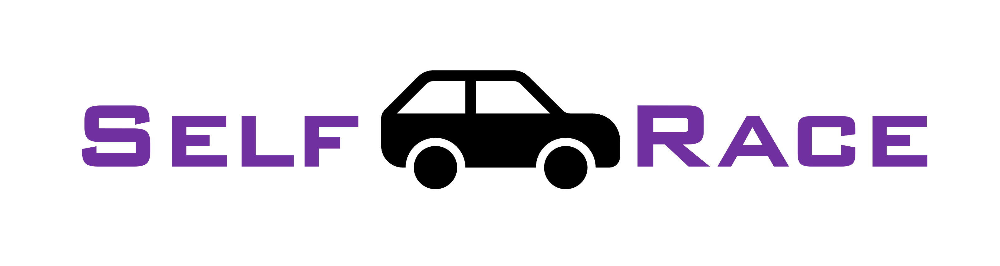

<p align="center">
  <a href="https://github.com/HongfeiWan/Selfrace">
    
  </a>
</p>

<p align="center">
  <a href="https://github.com/pytorch/pytorch">
    
  </a>
  <a href="https://github.com/NVIDIA/cuda-python">
    
  </a>
  <a href="./LICENSE">
    
  </a>
</p>

<p align="center">
  <strong>简体中文</strong> · <a href="./README_EN.md">English</a>
</p>

# Selfrace

Selfrace 是一个面向自动驾驶研究的 GPU 并行多智能体仿真与自博弈 PPO 训练项目。它基于预处理道路地图，在 PyTorch 中同时模拟大量交通世界和车辆，并训练每辆车共享的驾驶策略。

本仓库参考论文 [Robust Autonomy Emerges from Self-Play](https://arxiv.org/abs/2502.03349) 中的环境、观测、动作、随机化和优势筛选 PPO 设计，但它是独立的研究实现，并非论文作者的官方代码，也不保证与论文结果逐项等价。

> [!WARNING]
> Selfrace 是研究与实验软件，不是经过安全认证的自动驾驶系统，请勿用于真实车辆控制。

## 主要能力

- **GPU 批量仿真**：一个进程可并行维护多个世界，每个世界包含多辆可学习车辆。
- **统一训练入口**：单卡和 DDP 多卡共用同一套 rollout/PPO 主循环；通过 `--gpus` 选择设备，不需要手动调用 `torchrun`。
- **显存自适应**：启动时按空闲显存调整环境数；rollout、特征缓存和 PPO microbatch 遇到 CUDA OOM 时会减小安全批量并逐步恢复。
- **自博弈驾驶任务**：所有活动车辆都由同一策略控制，并独立采样车辆尺寸、动力学风格、奖励系数和路线目标。
- **结构化观测**：状态、路线目标、奖励条件、道路边界、车道点、停止线和邻车由统一的命名 schema 管理。
- **独立 Actor/Critic**：策略与价值网络不共享权重，集合输入使用置换不变编码器。
- **完整训练恢复**：当前格式的 checkpoint 保存模型、优化器、学习率调度器、AMP、随机数状态和显存自适应状态。
- **SwanLab 记录**：可由 rank 0 记录奖励、事件率、PPO 指标、耗时和 CUDA 显存。
- **Windows 推理界面**：Pygame 俯视图显示车辆、道路、路线、12 个动作概率，以及观察车辆实际使用的道路边界点。

## 运行要求

| 用途 | 要求 |
| --- | --- |
| 训练 | NVIDIA GPU、可用的 CUDA 版 PyTorch；Linux 更适合多卡训练 |
| Windows 可视化 | Python 3.10+；可使用 CPU 或 CUDA，仓库已提供 VS Code F5 配置 |
| 多卡 | 每张 GPU 一个进程；Linux 使用 NCCL，Windows 使用 Gloo |
| 可选功能 | SwanLab 在线记录、Matplotlib 手工诊断、pytest 测试 |

顶部版本徽章保留了项目原有的参考环境标识；实际可安装版本范围以 [`requirements.txt`](./requirements.txt) 为准。训练前请确认安装的是与本机驱动兼容的 CUDA 版 PyTorch：

```python
import torch
print(torch.__version__)
print(torch.cuda.is_available())
```

## 安装

```powershell
git clone https://github.com/HongfeiWan/Selfrace.git
cd Selfrace

# 二选一：uv 可自动获取 Python 3.12；已安装系统 Python 3.12 时可用下一行注释中的命令
uv venv --python 3.12 --seed .venv
# py -3.12 -m venv .venv
.\.venv\Scripts\Activate.ps1
python -m pip install --upgrade pip
python -m pip install -r requirements.txt
```

Linux 下将虚拟环境创建和激活命令替换为：

```bash
python3 -m venv .venv
source .venv/bin/activate
python -m pip install --upgrade pip
python -m pip install -r requirements.txt
```

训练用户应先按照 [PyTorch 官方安装页面](https://pytorch.org/get-started/locally/) 安装与驱动匹配的 CUDA 构建，再安装其余依赖。从仓库根目录运行所有命令，以确保地图和配置的相对路径正确解析。

## 快速查看策略效果

仓库包含一个用于界面演示的 checkpoint：`training/checkpoints-paper-goals/ckpt_step_400.pt`。

### VS Code 中按 F5

1. 用 VS Code 打开仓库根目录。
2. 安装 Microsoft Python 与 Python Debugger 扩展。
3. 确认 `.venv` 已按上节创建并安装依赖。
4. 选择 **Selfrace Game Inference**，按 `F5`。

项目内的 [`.vscode/launch.json`](./.vscode/launch.json) 已指定 `.venv`、示例 checkpoint、CPU 和 24 辆车。

### 命令行启动

```powershell
python .\game\game.py `
  --checkpoint .\training\checkpoints-paper-goals\ckpt_step_400.pt `
  --device cpu `
  --envs 1 `
  --agents 24
```

使用 CUDA 推理时，将 `--device cpu` 改为 `--device cuda:0`。无窗口检查可以使用：

```powershell
python .\game\game.py `
  --checkpoint .\training\checkpoints-paper-goals\ckpt_step_400.pt `
  --device cpu `
  --envs 1 `
  --agents 24 `
  --headless `
  --steps 120
```

示例 checkpoint 是早期权重格式，只用于 `game/game.py` 推理；当前训练器的 `--resume` 只接受它自己生成的版本化完整 checkpoint。

### 界面说明

- 绿色车辆：当前观察车辆。
- 金色车辆：其他活动车辆。
- 亮青色点：当前观察车辆实际输入网络的 `W_boundary` 道路边界点。
- 右侧动作面板：12 个离散动作及当前策略概率。

| 按键 | 功能 |
| --- | --- |
| `Space` | 暂停/继续 |
| `Tab` | 切换观察车辆 |
| `[` / `]` | 切换世界 |
| `+` / `-` | 缩放 |
| `B` | 显示/隐藏观察到的道路边界点 |
| `C` | 切换北向上/随车朝向相机 |
| `W` | 显示/隐藏其他车辆路线点 |
| `M` | 切换 argmax/随机采样动作 |
| `R` | 重置 |
| `Esc` | 退出 |

## 训练

### 小规模连通性检查

默认配置面向大显存长训练。第一次运行建议显式降低每卡环境数：

```powershell
python .\training\train.py `
  --gpus 0 `
  --num-envs 8 `
  --updates 2 `
  --checkpoint-dir .\training\checkpoints-smoke
```

训练入口要求 CUDA；没有可用 GPU 时会直接退出。

### 单卡长训练

```powershell
python .\training\train.py `
  --gpus 0 `
  --updates 10000 `
  --checkpoint-dir .\training\checkpoints
```

### DDP 多卡训练

```bash
python training/train.py \
  --gpus 0,1,2,3 \
  --updates 10000 \
  --checkpoint-dir training/checkpoints-ddp
```

`simulator.num_envs` 表示**每张 GPU**的世界数，因此全局世界数为 `num_envs × GPU 数量`。训练器会自行启动工作进程和选择本地 rendezvous 端口。

### 恢复训练

```powershell
python .\training\train.py `
  --resume .\training\checkpoints\latest.pt `
  --updates 20000 `
  --gpus 0 `
  --checkpoint-dir .\training\checkpoints
```

`--updates` 表示训练停止时的**最终 update 编号**，不是额外再训练多少次。一次 update 固定包含一个 rollout 和一次 PPO 更新。当前 checkpoint 文件命名为 `ckpt_update_<N>.pt`，并原子更新同目录下的 `latest.pt`。

### SwanLab

完成本机 SwanLab 登录后，可通过命令行启用记录：

```bash
python training/train.py \
  --gpus 0 \
  --updates 10000 \
  --checkpoint-dir training/checkpoints-swanlab \
  --swanlab \
  --swanlab-project Selfrace \
  --swanlab-experiment selfrace-longrun \
  --swanlab-id selfrace-longrun-01 \
  --swanlab-resume allow
```

只有 rank 0 会创建和上传实验。请将登录凭据保留在 SwanLab 的用户级配置中，不要写入仓库。

## 核心设计

### 仿真循环

`TeraflowSimulator` 协调以下组件：

1. 根据 12 个离散 jerk 动作更新运动学自行车模型；
2. 检查车辆间连续碰撞、静态碰撞和离路；
3. 计算 Frenet 坐标、停止线事件和奖励；
4. 推进路线目标，并在 rollout 边界对完成的世界执行 masked reset；
5. 按需为活动车辆重建网络特征。

地图在运行前已处理为道路四边形、中心线、边界、路由和交通控制数据；训练和推理不需要启动 CARLA。

### 动作空间

动作是纵向 jerk 与横向 jerk 的笛卡尔积：

- 纵向 jerk：`{-15, -4, 0, 4} m/s³`
- 横向 jerk：`{-4, 0, 4} m/s³`
- 总计：`4 × 3 = 12` 个动作

### 观测与网络

默认命名 schema 的输入宽度为 977：

| 组 | 宽度 | 含义 |
| --- | ---: | --- |
| `state` | 13 | 自车局部状态与动力学状态 |
| `goal` | 8 | 最多 4 个剩余路线目标的相对位置 |
| `reward` | 12 | 当前车辆的奖励条件参数 |
| `vehicle_style` | 4 | 车辆动力学/驾驶风格参数 |
| `road_boundary` | 160 | 道路边界点集合 |
| `lane_points` | 560 | 车道几何与路线距离集合 |
| `stop_lines` | 20 | 停止线集合 |
| `other_agents` | 200 | 邻车集合及有效标记 |

特征构建器、Actor 和 Critic 共用 [`training/feature_schema.py`](./training/feature_schema.py) 中的同一布局校验。Actor 与 Critic 参数独立，并顺序执行以控制峰值显存。

### 路线、随机化与奖励

- 每辆活动车辆首先从可路由道路块中均匀采样目标，再采样 0–3 个后续目标。
- 后续目标优先满足 20–200 m 距离和不超过 60° 的车道朝向变化；没有候选时逐级放宽。
- 每个世界随机化车辆尺寸、驾驶风格、奖励权重和交通灯状态。
- 奖励包含目标、碰撞、离路、舒适度、车道朝向、车道中心、速度、倒车、停止线和时间步分量。

### PPO 与显存策略

- rollout 只为活动车辆构建特征；完整观测不写入 rollout buffer。
- 使用 GAE、PPO clipping、优势筛选和多 epoch 更新。
- 选中的 PPO 特征每次 update 只构建一次；显存不足时可缓存到 pinned CPU 内存。
- PPO 通过 microbatch 累积保持有效样本目标，而不是因为显存不足直接缩小优化 batch。
- 碰撞检测按 `collision_stream_pair_budget` 有界分块，限制 pair 临时张量峰值。
- Linux CUDA 可对网络和碰撞块使用受控 `torch.compile`；Windows、CPU 或编译失败时自动回退 eager。

## 关键配置

所有运行参数集中在 [`configs/default_config.yaml`](./configs/default_config.yaml)。常用默认值如下：

| 配置 | 默认值 | 含义 |
| --- | ---: | --- |
| `simulator.num_envs` | 2600 | 每张 GPU 的并行世界数 |
| `simulator.max_agents_num` | 150 | 每个世界的车辆槽位上限 |
| `simulator.sim_dt` | 0.3 | 仿真步长（秒） |
| `training.rollout_length` | 128 | 每次 PPO 更新前的 rollout 长度 |
| `training.batch_size_per_gpu` | 32000 | 每个 rank 的 PPO 目标样本上限 |
| `training.ppo_epochs` | 3 | 每批数据的 PPO epoch 数 |
| `training.gamma` | 0.999 | 折扣因子 |
| `training.gae_lambda` | 0.95 | GAE 参数 |
| `training.learning_rate` | 5e-4 | Actor 和 Critic 学习率 |
| `training.precision` | `16-bit` | CUDA AMP 精度 |
| `training.total_updates` | 10000 | 最终 update 编号 |

注意事项：

- `max_episode_length` 必须能被 `rollout_length` 整除，因为世界重置发生在 rollout 边界。
- 默认 `2600 × 150` 是目标规模，不适合作为第一次运行的 smoke test。
- `memory_adaptation` 会根据启动时空闲显存降低世界数，并分别记录 rollout、特征构建和 PPO 的安全 chunk。
- 网络输入只接受命名的 `feature_schema`；旧的平行维度列表不再兼容。
- 当前训练 checkpoint 格式不提供旧格式迁移，以免静默丢失优化器或自适应状态。

## 仓库结构

```text
Selfrace/
├── configs/          # 默认仿真、PPO、网络与记录配置
├── simulator/        # 世界初始化、动力学、道路、观测、碰撞、离路和奖励
├── training/         # 单卡/DDP 主循环、网络、特征 schema、checkpoint 与 SwanLab
├── game/             # Pygame checkpoint 推理界面
├── maps/             # CARLA OpenDRIVE、处理后地图和地图构建/检查脚本
├── tests/            # 确定性单元与结构测试
├── scripts/manual/   # 需要窗口、CUDA 或大型地图的手工诊断
├── paper/            # 随仓库保存的中英文技术稿件
├── images/           # Logo 与项目图像
└── course/           # 网络相关实验 notebook
```

当前默认地图是 `maps/processed_map_Town01_stitched.json`。仓库还包含多个 Town 地图和 `.xodr` 源文件；切换训练地图时修改 `simulator.map_path`，并确保相应的路由/路口处理数据存在。

## 测试与手工诊断

安装 pytest 后运行：

```powershell
python -m pytest -q
```

交互式绘图和大型组件检查位于 [`scripts/manual/`](./scripts/manual/README.md)：

```powershell
python .\scripts\manual\network_demo.py
python .\scripts\manual\simulator_demo.py
```

其中部分脚本需要 CUDA、地图资源或可交互的 Matplotlib 窗口；快速且确定的回归检查应放在 `tests/`。

## 资料

- 原论文：[Robust Autonomy Emerges from Self-Play](https://arxiv.org/abs/2502.03349)
- 仓库内英文稿件：[paper/main.pdf](./paper/main.pdf)
- 仓库内中文稿件：[paper/selfplay_selfrace_zh.pdf](./paper/selfplay_selfrace_zh.pdf)
- 手工诊断说明：[scripts/manual/README.md](./scripts/manual/README.md)

## 许可证

本项目采用 [GNU General Public License v3.0](./LICENSE)。
